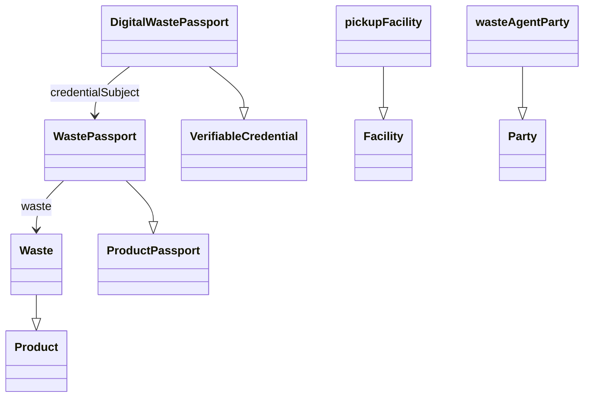

# digitalWastePassport Ontology

- **Link to ontology:** [ontology/v0.1/digitalWastePassport.ttl](https://blue-room-innovation.github.io/dcasr-ontology/ontology/v0.1/digitalWastePassport.ttl)

## Classes

|Name|Description|Datatype properties|Object properties|Subclass of|
| :--- | :--- | :--- | :--- | :--- |
|DigitalWastePassport|The Digital Waste Passport is a comprehensive data structure that encapsulates detailed information pertaining to a specific waste entity, including its identification details, issuing authority, validity period, and provenance information. It also incorporates references to the associated WastePassport, enabling verifiable tracking, traceability, and compliance with waste management and sustainability requirements throughout the waste lifecycle.||[credentialSubject](#credentialSubject)|VerifiableCredential|
|Waste|The Waste class encapsulates detailed information regarding a specific waste item, including its identification details, origin, characteristics, and relevant classification data. It also includes attributes related to its handling, composition, and provenance, supporting accurate documentation and management within the waste lifecycle.|||Product|
|WastePassport|The WastePassport class encapsulates comprehensive information about a specific waste entity, including its identification details, classification, and traceability attributes. It provides a structured framework to document the waste’s origin, composition, performance, and associated materials, enabling consistent tracking and reporting throughout its lifecycle||[waste](#waste)|ProductPassport|
|pickupFacility|The physical location (e.g., farm, factory, or other production site) where the waste was generated or collected.|||Facility|
|wasteAgentParty|An organization involved in the management, certification, or regulation of waste. This could include supply chain actors, certifiers, government agencies, or other relevant parties.|||Party|
|Product|||||
|VerifiableCredential|||||
|ProductPassport|||||

## Object Properties

|Name|Descriptions|Domain|Range|Subproperty of|
| :--- | :--- | :--- | :--- | :--- |
|credentialSubject|The credentialSubject references the associated WastePassport, which contains the detailed waste-specific information and attributes being verified.|[DigitalWastePassport](#DigitalWastePassport)|[WastePassport](#WastePassport)||
|waste|The waste property references the associated Waste instance, encapsulating detailed characteristics and classification data of the waste being documented.|[WastePassport](#WastePassport)|[Waste](#Waste)||
