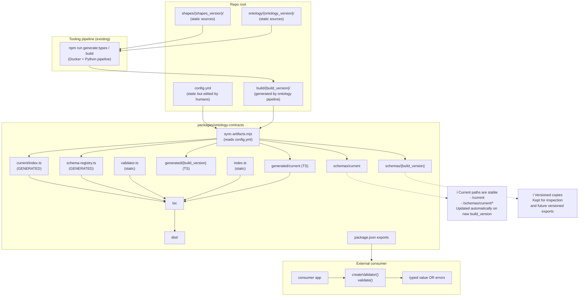

# @blueroominnovation/ontology-contracts

Consumable Node.js/TypeScript (ESM) package that publishes:

- **JSON Schemas** generated (from SHACL)
- **TypeScript typings** generated
- **AJV Validator** integrated with typed `schemaKey` (the user only imports the validator and validates)

Requisits:

- Node.js **>= 20**
- Projecte en mode **ESM** (`"type": "module"`) o TypeScript amb `module: NodeNext`

## Usage

### Installation

```bash
npm i @blueroominnovation/ontology-contracts
```

### Validation (recommended API)

The main API is generic and typed: `validate(data, schemaKey)`.

```ts
import {
  createValidator,
  type SchemaKeyV01,
  type DigitalWastePassport,
} from "@blueroominnovation/ontology-contracts";

const validator = createValidator();

const schemaKey: SchemaKeyV01 = "digitalWastePassport";

const payload: unknown = {
  "dct:issued": "2026-01-16T00:00:00Z",
  "dct:publisher": "example-publisher",
  "dwp:credentialSubject": {
    "dwp:waste": {
      "unece:name": "Example waste",
      "unece:productName": "Example product",
    },
  },
};

const result = validator.validate(payload, schemaKey);

if (!result.ok) {
  // Normalized AJV errors
  console.error(result.errors);
  process.exit(1);
}

// IMPORTANT: el tipus de result.value depèn del schemaKey
const typed: DigitalWastePassport = result.value;
console.log("Issued:", typed["dct:issued"]);
```

### "assert" mode (exception if invalid)

If you prefer to fail fast and get narrowing via TypeScript:

```ts
import { createValidator, type SchemaKeyV01 } from "@blueroominnovation/ontology-contracts";

const validator = createValidator();
const schemaKey: SchemaKeyV01 = "digitalWastePassport";

const payload: unknown = /* ... */;
validator.assertValid(payload, schemaKey);

// From here on, payload is typed according to schemaKey
payload["dct:issued"]; // OK
```

### Ajv injection (optional)

To share the same Ajv instance across the entire app (plugins, options, etc.):

```ts
import Ajv from "ajv";
import addFormats from "ajv-formats";
import { createValidator } from "@blueroominnovation/ontology-contracts";

const ajv = new Ajv({ allErrors: true, strict: false, strictSchema: false });
addFormats(ajv);

const validator = createValidator({ ajv });
```

> Note: `createValidator()` already creates an internal Ajv with `ajv-formats`. Injection is only if you want to control configuration or share Ajv.

### Schemas disponibles (v0.1)

The currently supported `schemaKey` are:

- `"digitalWastePassport"`
- `"digitalMarpolWastePassport"`

The root types we export are:

- `DigitalWastePassport`
- `DigitalMARPOLWastePassport`

You can also import only the version "contract":

```ts
import type {
  SchemaKeyV01,
  DigitalWastePassport,
} from "@blueroominnovation/ontology-contracts/v0.1";
```

### Recomanat: entrypoint `current`

To avoid having to touch imports when you change `build_version` in `config.yml`, you have a stable entrypoint:

```ts
import type { SchemaKeyCurrent } from "@blueroominnovation/ontology-contracts/current";
```

I schemas a:

- `@blueroominnovation/ontology-contracts/schemas/current/*`

### Accés als JSON Schema (power users)

El paquet publica els fitxers a `./schemas/v0.1/*.schema.json`.

If your runtime supports JSON modules, you can import them directly; otherwise, use `fs` and `import.meta.url`.

Example (Node ESM, reading via fs):

```ts
import fs from "node:fs";

const url = new URL(
  "../node_modules/@blueroominnovation/ontology-contracts/schemas/v0.1/digitalWastePassport.schema.json",
  import.meta.url,
);
const schema = JSON.parse(fs.readFileSync(url, "utf8"));
```

## Development

From the repo root:

- `npm run contracts:build` (synchronizes `build/v0.1/` → package and compiles TS)
- `npm run contracts:test` (executes the consumer-example as an integration test)

The consumer-example is in `examples/consumer-node-ts/`.

### Com s'actualitza quan canvies versions / shapes

La part “packages” **llegeix `config.yml`** i sincronitza automàticament el que hi ha a:

- `build/<build_version>/...` (ex. `build/v0.2/`)

Concretament fa servir `generation.artifacts` per saber quins schemas i quins `.ts` de tipus ha de copiar.
Quan fas `npm run contracts:build`, el script:

1. Copia schemas cap a `schemas/current/` i `schemas/<build_version>/`
2. Copia tipus cap a `src/generated/current/` i `src/generated/<build_version>/`
3. Genera `src/current/index.ts` (schema keys + map de tipus) i `src/schema-registry.ts` (runtime urls)

---

## Flux complet (Mermaid)



### Què toca a mà vs automàtic (resum ràpid)

- **A mà (quan canvies versions o afegeixes contracts):** edites `config.yml` (`build_version` + `generation.artifacts`) i generes `build/<version>` amb el pipeline.
- **Automàtic (cada `contracts:build`):** copia schemas/tipus + regenera `src/current/index.ts` i `src/schema-registry.ts` + compila a `dist/`.
- **Estàtic (normalment no es toca):** `src/validator.ts`, `src/index.ts`, `package.json exports`.
